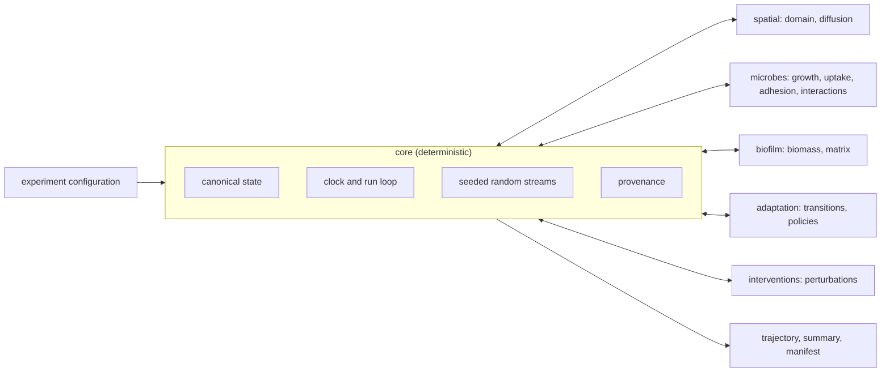

# Architecture

*Phase 0 design. Module names follow the planned layout; interfaces are
finalized as each phase lands ([roadmap](roadmap.md)).*

## Principles

- **Small deterministic core, replaceable providers.** The core owns state,
  time, orchestration, spatial bookkeeping, random seeds, provenance and
  serialization. Scientific providers own the biological equations or rules,
  so alternative models can be compared on identical infrastructure.
- **Explicit contracts.** Providers exchange information only through declared
  state variables that carry units and scale metadata.
- **Reproducibility as a feature.** Every run can be replayed from its manifest.



## Package layout

```text
src/marse/
  core/            simulation.py (run loop, clocks, checkpoints), state.py, config.py, provenance.py,
                   integrators.py, ledger.py, well_mixed.py (the version 2 network engine)
  schemas/         configuration schema v2: formula.py, network.py (reaction networks), experiment.py
  spatial/         domain.py, grid.py, neighborhoods.py, diffusion.py
  microbes/        growth.py, resource_use.py, adhesion.py, phenotype.py, interactions.py
  biofilm/         biomass.py, matrix.py, maturation.py
  ecosystem/       the 2-D multispecies engine (model.py, providers.py, framestore.py, viewer.py)
  adaptation/      transitions.py, policies.py
  interventions/   perturbations.py
  analysis/        calibration.py, uncertainty.py, ensemble.py
  evidence/        science.py (culture evidence and the evidence-to-experiment compiler)
  experimental/    host/: immune.py, actions.py, outside the v1.0 claims
  validation/      analytical/, regression/, literature_cases/
```

Implemented so far (the rest of the layout above is planned):

| Package | Modules |
|---|---|
| `core/` | `config`, `state`, `seeds`, `provenance`, `simulation`, `integrators`, `ledger`, `well_mixed` |
| `spatial/` | `domain`, `diffusion`, `solutes` |
| `microbes/` | `growth`, `cardinal`, `kinetics`, `niche`, `genotype`, `additives` |
| `schemas/` | `formula`, `network`, `experiment`: configuration schema v2 (reaction networks checked for continuity, with rates and run settings) |
| `biofilm/` | `biomass` |
| `ecosystem/` | `model`, `providers`, `framestore`, `viewer` (not yet verified: see validation.md) |
| `analysis/` | `calibration`, `uncertainty`, `ensemble` |
| `evidence/` | `science` |
| `experimental/host/` | `immune`, `actions` |
| `validation/` | `analytical`, `benchmarks` |

`adaptation/` and `interventions/` exist but are still empty.
Modules that used to sit at the package root (`marse.niche`,
`marse.ensemble` and so on) keep a deprecated alias there for one release.

## Providers

A provider is a versioned implementation of one scientific concern, for
example `growth_v1` or `finite_difference_v1`. Every provider declares:

- a stable name and version, recorded in the run manifest;
- the biological scale and resolution it works at;
- the state variables it reads and writes, with units;
- its parameters, each with units, source and confidence;
- its assumptions and known limitations.

An illustrative shape, not a final API:

```python
class GrowthModel(Protocol):
    name: str  # for example "growth_v1"
    scale: Scale

    def rates(self, state: PopulationState, resources: ResourceField, dt: float) -> GrowthRates: ...
```

The spatial ecosystem now has a concrete first contract in
`marse.ecosystem.providers`. `ExplicitTransportProvider` advances one
field with an explicit two-dimensional finite-difference operator and fixed
boundaries. That operator is not yet verified: unlike the one-dimensional
solver in `marse.spatial.diffusion`, it has not been checked against an
analytical solution (see
[validation.md](validation.md#the-two-dimensional-ecosystem-engine-is-not-yet-verified)).
`EcosystemProviders` declares transport, biomass spreading, reaction, biomass,
and diagnostics versions. Every ecosystem result records
these versions, and the default providers preserve the existing numerical
behavior. Future reaction, mechanics, or stochastic providers must implement
the same state-and-units boundary rather than modifying the orchestration loop.

## Run lifecycle

1. Load and validate the experiment configuration: units, ranges, providers
   and parameter sources.
2. Build the initial state, and derive an independent random stream for each
   provider from the run seed.
3. Advance the clock. At each step, apply scheduled perturbations, then update
   the providers in a fixed order that is declared in the configuration and
   recorded in the manifest.
4. Write checkpoints at the configured interval.
5. Write the outputs and the manifest. A replay re-runs from the manifest and
   compares the results.

## Provenance

Every run is replayable from its manifest, for example:

```yaml
run_id: MARSE-000184
marse_version: 0.8.0
seed: 184221
spatial_model: grid_v2
resolution_um: 10
step_minutes: 5
diffusion_solver: finite_difference_v1
organism_models:
  species_A: growth_v1
  species_B: growth_v1
interaction_model: pairwise_v1
parameter_sources:
  - source_001
  - source_002
outputs:
  - trajectory.parquet
  - summary.json
  - manifest.yaml
```

Manifests record random seeds, software and provider versions, parameters,
numerical methods, boundary conditions, initial states and a SHA-256 checksum
of every input.

The implemented manifest (`marse.core.provenance`) is JSON with sorted keys, so
the same run produces byte-identical output and manifests diff cleanly. The
`run_id` is derived from the configuration checksum, which means the same
experiment always carries the same identifier and re-running is idempotent.
Reading a manifest re-verifies the checksum, so one edited after the run is
refused rather than replayed into different results.

Each manifest names its `kind` (`batch`, `biofilm_profile` or `ecosystem`), and
`marse replay` rebuilds the configuration with the parser for that kind. A
manifest whose configuration does not match its declared kind is refused.
`kind` arrived with manifest format version 2. Version 1 manifests, which
predate the ecosystem engine, remain readable: their kind is recovered from the
configuration. An ecosystem manifest also records a SHA-256 digest of the
entire final state, so a replay compares every value, not only summary totals.

Frames, the snapshots a run records along the way, are separate from the
result. `run(config, frame_every=..., sink=...)` records every `frame_every`
steps plus the last, or only the first and last when `frame_every` is `None`,
and hands each frame to an optional sink as it is made. Recording only
observes: every setting yields a bit-identical final state, and a test holds
the engine to that. `marse.ecosystem.framestore` provides the standard sink:
one preallocated `.npy` file per field, written in place through a memory map,
with an `index.json` naming the fields, their shapes and types, and each
frame's time and step. The store knows nothing about ecosystems, so a later
engine reuses it with different fields.

### Privacy rules for manifests and outputs

Manifests and outputs are designed to be shared, attached to papers, issues
and archives, so they must never identify the person or machine that produced
them:

- no usernames, hostnames, IP addresses or environment variables;
- no absolute paths: inputs are recorded relative to the experiment file,
  with their checksum;
- platform details limited to the operating-system family and the versions of
  Python and key libraries;
- timestamps in UTC.

MARSE makes no network requests and sends no telemetry. Tests will assert
these rules once `core.provenance` exists.

## Decision policies

Some meta-simulation decisions can be delegated to a `DecisionPolicy`: choosing
among predefined simulation branches, flagging unusual or uncertain states, or
deciding which parameter region to explore next.

```text
SimulationState
      |
      v
DecisionPolicy
  |-- RuleBasedPolicy         (default; deterministic reference)
  |-- StatisticalPolicy       (optional)
  `-- ExternalPolicyAdapter   (optional; experimental)
      |
      v
Typed action: switch phenotype | request additional simulation |
              choose a predefined perturbation branch | flag uncertain state | abstain
```

- The action space is an enumerated set of typed actions. A policy never sets
  physical constants or biological rates and never invents mechanisms.
- Every decision is logged with its inputs, the chosen action, any
  probabilities, and the policy's name and version.
- A simulation stays reproducible with external policies disabled; the
  rule-based policy is the baseline that other policies are benchmarked against.
- The core does not depend on any external policy package. Adapters are
  optional extras.

## Dependencies

The core aims for a small, stable scientific stack. The expected choices are
NumPy and SciPy for numerics, a validation library for configuration, and
PyYAML for experiment files. Output formats such as Parquet, visualization and
external adapters are optional extras. Every new runtime dependency is
justified in its pull request.

## Extension points after v1.0

The interfaces leave room for later work without changes to the core: richer
metabolic models, host-cell and immune-state models, molecular (docking or
molecular dynamics) providers, research on learned policies,
intervention-specific models and multiscale coupling studies.
