# Experimental Pocket Explorer

An optional educational viewer of one generic adult human periodontal pocket
beside FDI 36. It is separate from MARSE's solver and native applications.
Authored anatomy, published qualitative observations and saved teaching fields
remain distinct inputs. Viewer controls change presentation only.

The opening view is Periodontitis / Pocket / Species / Evidence with a quarter
cutaway and labels. Mouth → Tooth → Pocket stays within one scene. Healthy
changes authored landmarks, not a progression model. All nine saved taxon
selections remain available in their original assumed 32 × 72 grid.

## Build and view

Requires Node.js 22 or newer and Blender 5.2.2 LTS for the checked authoring build.
Where the Blender application is unavailable, the matching `bpy==5.2.2` module
(Python 3.13) runs the same script; see docs/verification.md.
From this directory:

```sh
npm ci
npm run anatomy
npm run build
npm run check
python3 -m http.server 8972 --bind 127.0.0.1
```

Open `http://127.0.0.1:8972/pocket.html`. Runtime scripts/textures are bundled;
there are no remote runtime assets or solver calls. Evidence links are optional
external references. Rebuild requires installed tools and dependencies; Node
installation is separate from the Python engine. The app has a 2D fallback.

Meshes, GLB, editable Blender files, packed buffers and JavaScript bundles are
rebuildable outputs ignored by Git. No bulk trajectory, raw authoring reference,
local execution log, Cycles metadata or native app is committed. The Python
script retains the earlier scaffold's reference hash but generates every live
mesh from its own rules; it does not need that reference file. No atlas triangles
were reused. This package does not add an automatic CI release or deployment.

## What goes in → what happens → what comes out

Generic Blender rules and two authored landmark presets → crown, root, pulp,
coverings, socket, separate cortical/trabecular bone and soft-tissue volumes →
an editable local anatomy and rotatable quarter cutaway. Layer widths are
exaggerated for reading and have no measured millimetre calibration.

Source-scoped human observations → schematic across-plaque detail → selected
observations and unresolved locations. Findings from selected advanced-disease
specimens never populate Healthy. Group-level observations remain groups.

Two preserved synthetic teaching endpoints → original grid and taxon controls →
read-only density images with contrast/overlap explanations. Endpoint hashes
retain the original trajectory identity as provenance; the full historical
trajectory is not included. Viewer precision is not a solver final-state digest.

## Verification and remaining limitations

The originating local art pass passed type checking and 56 software checks,
including original engine/protocol preservation checks. Those 56 are not this
package's test count. Package-specific replay results are in docs/verification.md.
All 41,472 endpoint values were compared with the original arrays before
packaging; this package locks the extracted endpoint identities independently.

**Art pass (claude/pocket-art-pass).** The basal gingival edge is now a
continuous rolled edge on the cortical plate. Gingiva and connective tissue are
lofted from per-azimuth sections authored against ray-cast tooth and bone
surfaces. Their embedded parts sit inside hard tissue, so the socket, cementum
and pocket cuts cross steeply, and no soft-tissue voxel repair is needed. The
crown has buccal/lingual heights of contour, occlusal convergence, triangular
and marginal ridges, and grooves continuing onto the buccal and lingual faces.
Roots end in blunt apices with proximal concavities. The pulp chamber is a
rounded box with horns. A thin cortical lining (lamina dura) surrounds the
socket. Gingival skin and connective core are separate, including a short
epithelial attachment band. Exported triangles are checked so every edge is
shared by exactly two faces.

Plaque appears as authored compartments that follow the tooth surface. A thin
supragingival film covers the cervical crown, and a subgingival film lines the
sulcus on the cheek (buccal) and tongue (lingual) sides; the selected distal
site keeps its pocket ribbon. These compartments assign **no species
positions**: supragingival plaque and every Healthy location stay "Location
unresolved", and source observations describe organisation across plaque
thickness, not positions around the tooth. Tooth view adds translucent authored
context: the cheek drawn back over the mesial half, showing the buccal
vestibule, and the lateral tongue border. A lower first molar faces the cheek;
the lips border the front teeth.

**Segment pass (claude/pocket-tissue-continuity).** FDI 36 now sits in a
three-tooth segment with partial FDI 35 (second premolar) and FDI 37 (second
molar, the 36 model scaled). These neighbours are authored context, not reviewed
anatomy. The gingiva is one continuous tissue. A lofted band covers the crest
and both plates, and its surface rises toward each neighbour's scalloped margin.
Papillae form where the neighbouring slopes meet in the embrasures. The detailed
36 collar emerges from that band. Bone is one alveolar segment whose crest
scallops around each tooth. Periodontitis loss stays at the 36 distal site and
forms a shared interdental crater with 37. The viewer trims every part to the
specimen ends, so the cut faces show enamel, dentin, pulp, ligament, cortical
and trabecular bone instead of a rounded demonstration block.

The crowns gained lobed axial walls and rounded transitions into the cusp slopes,
with flatter lingual faces. Grooves are slightly shaded so they read at a
glance. Pocket view frames the 36 distal pocket. Labels have stronger contrast,
and the selected tissue glows, one at a time. The pocket fluid label and
inspector state that widths are exaggerated: in the mouth the tissue lies close
against the tooth and no open gap is visible. Cheek and tongue context starts
under the gum's basal edge as alveolar mucosa, folds at the vestibule or floor of
the mouth, and fades toward the specimen ends. The biofilm detail adds an
orientation inset showing where on 36 the across-plaque view sits. Saved fields
carry a dashed frame and a "not placed on the tooth" badge. Exported meshes use
32-bit indices (packed format `/2`).

**Refinement pass (codex/pocket-refinement).** Neighbour crowns and supporting
meshes use coarser sampling; final display reduction keeps the selected enamel
and pocket walls intact and protects the rolled basal gum edge. FDI 37 has its
own four-cusp crown and cross grooves; FDI 35 remains an authored three-cusp
second-premolar variant. Cusp slopes are broader, the distal recession col is
rounded, and the bone crater returns smoothly to the surrounding crest. Healthy
landmarks are unchanged. The selected disease margin remains −0.15 and attachment
−6.2; crest samples at the distal surface remain approximately −8.50 model units.
These are authored coordinates, not millimetres or clinical measurements.

The gum has a subtle artistic transition from paler, stippled attached tissue
to smoother, redder mucosa. This is a material cue, not a measured mucogingival
junction. Prepared meshes, cut faces and label anchors are reused when returning
to a preset. Small stages show a few short labels, including the selected tissue;
all 16 structures remain available in the selector. Tooth view now names the
FDI 35–37 segment. Vessel and nerve selections have anchors on their schematic
meshes. Expanded source hashes wrap at narrow widths.

**Remaining limitations:** crowns, roots and tissue contours are still procedural
illustrations. Recession is an authored shape; nearby papillae, gingival collars
and section transitions can still look stylised. Some pulp horns and canals lie
outside a slice. Layer widths remain exaggerated and uncalibrated. Cheek/tongue
context is schematic and Mouth remains earlier procedural art. Expert anatomical
review is **pending**. First preparation of a preset still blocks briefly (about
3.5–5.9 seconds in the checked Mac browser); cached returns are much faster.
Caching retains up to four prepared variants, trading memory for responsiveness;
sustained memory and device profiling remain pending. Blender Boolean exports
can vary slightly between rebuilds; exact saved endpoints remain unchanged.

| Starting segment | Refined segment |
|---|---|
| 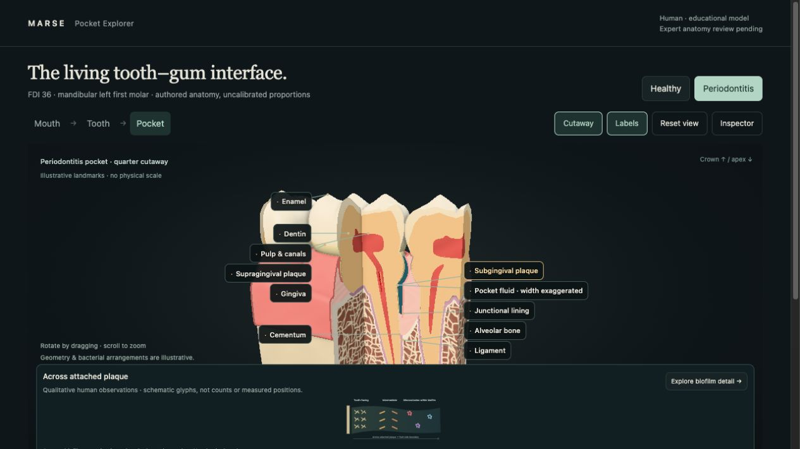 | 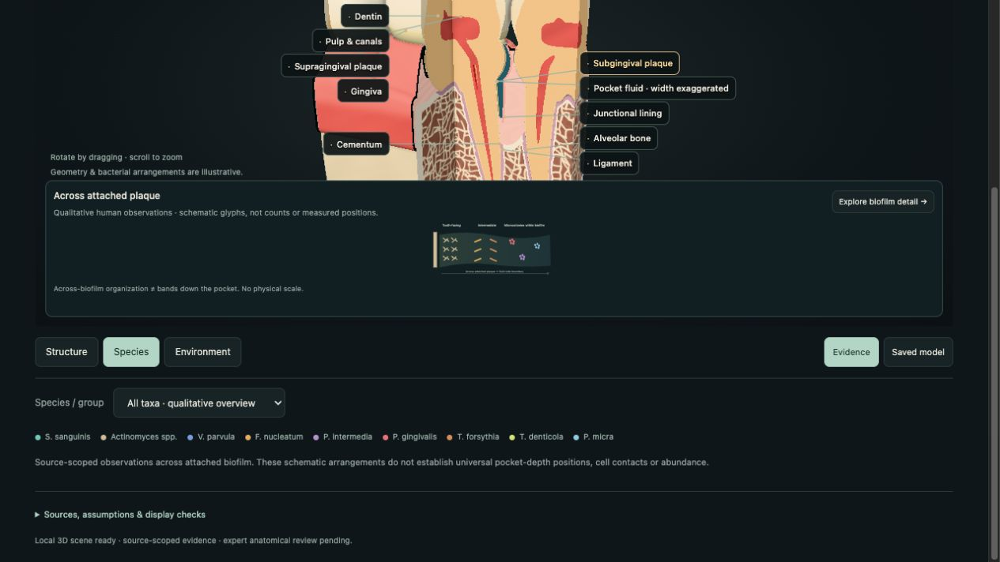 |
| 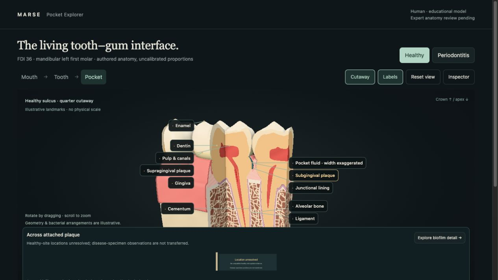 | 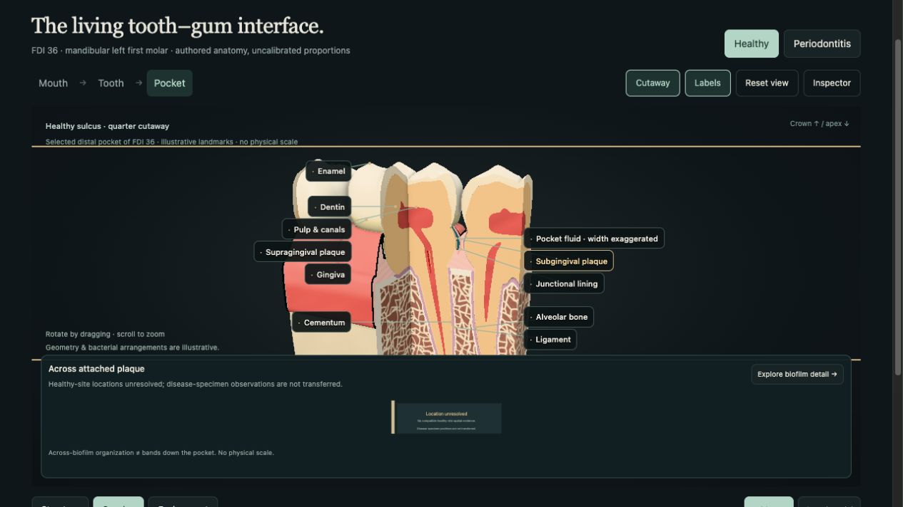 |

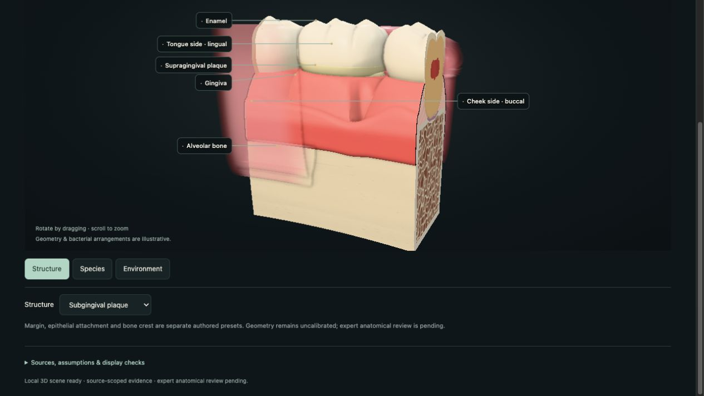

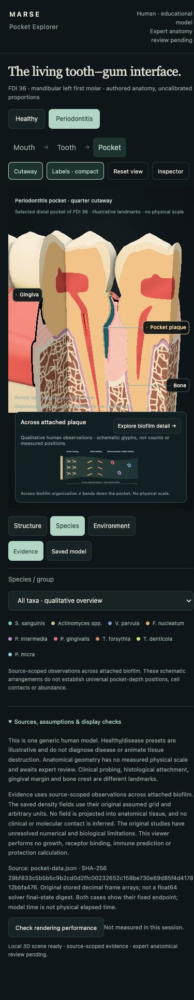

The forced fallback is `pocket.html?render=2d`. The optional `motion=reduce`
query checks the same reduced-motion presentation policy without changing the
operating system's accessibility setting. No autonomous orbiting is used.

| Before (art pass) | After (segment pass) |
|---|---|
|  | 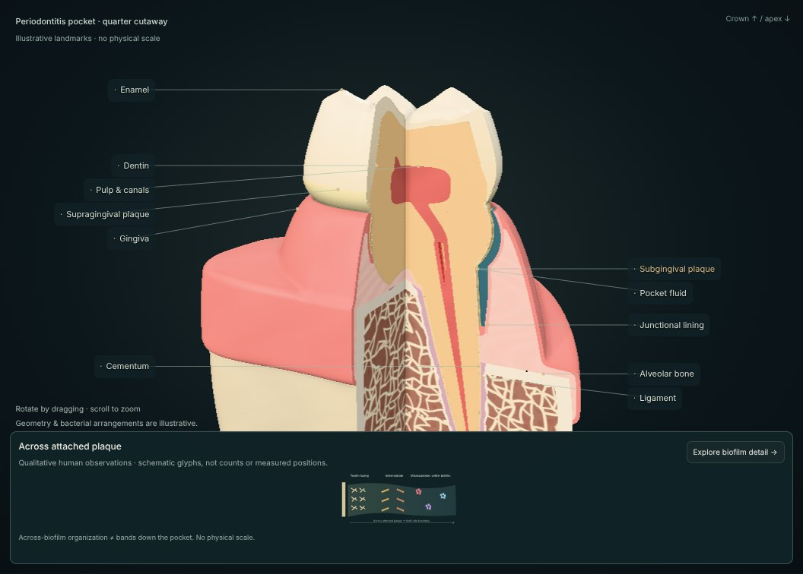 |
| 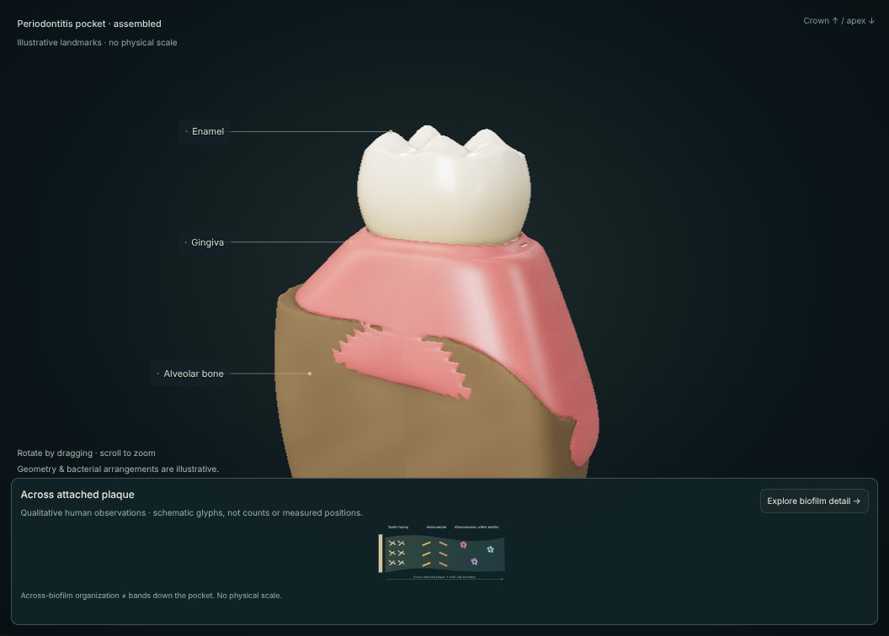 | 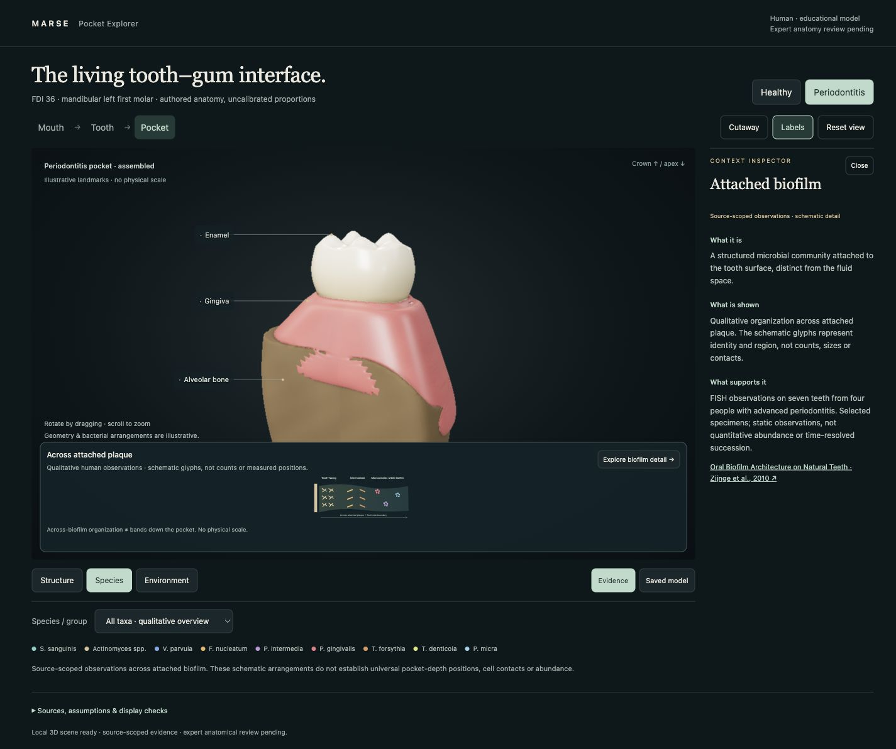 |

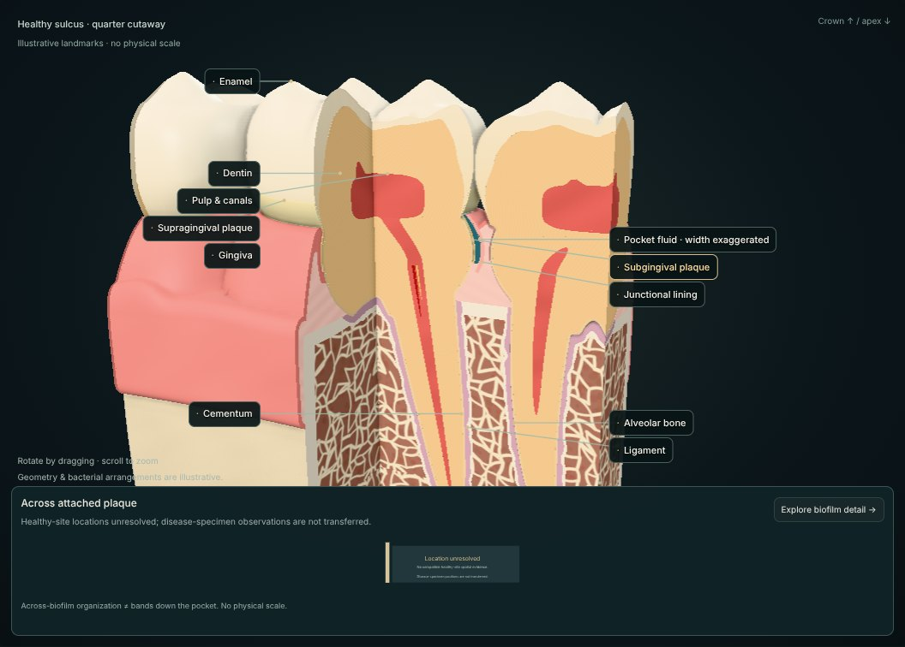

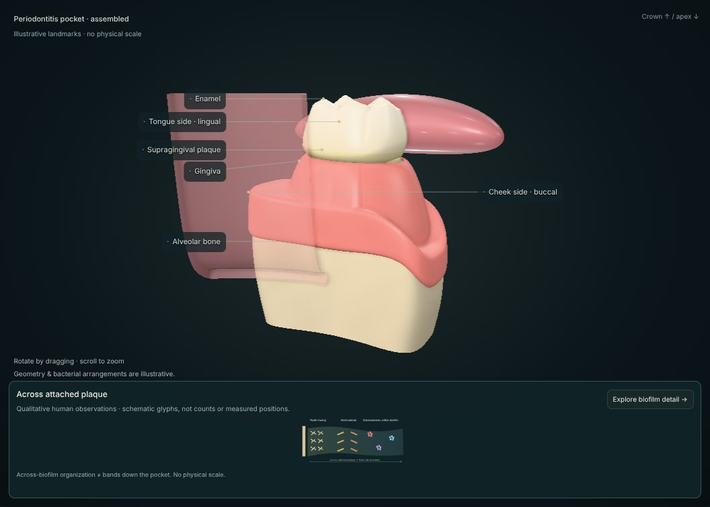

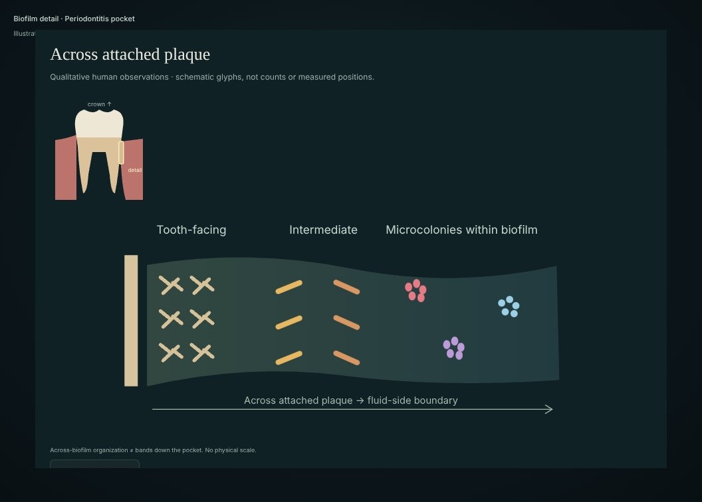

Software/topology checks establish their stated mesh/display properties only.
This is not clinical validation, measured pocket anatomy, diagnosis, or a model
of microbial contacts, oxygen gradients, immune function or disease progression.
Canine inference and immune binding/epitope scoring are excluded. MARSE's v1.0
scope is unchanged. Nothing feeds back into solver trajectories.

## Sources and licences

- [Oral Biofilm Architecture on Natural Teeth](https://pmc.ncbi.nlm.nih.gov/articles/PMC2827546/): selected human specimens and across-biofilm observations; not universal bands down a pocket.
- [Mandibular first-molar micro-CT research](https://pmc.ncbi.nlm.nih.gov/articles/PMC3662034/): qualitative root/canal morphology; no parameter calibration here.
- [Root/canal variation](https://pubmed.ncbi.nlm.nih.gov/30147408/): the chosen arrangement is not universal.
- [Human dentoalveolar micro-CT](https://pubmed.ncbi.nlm.nih.gov/29732712/): separate cortical/trabecular/socket context; not model calibration.

Viewer source and authored mesh rules are a MARSE contribution under the
repository's Apache-2.0 licence. Three.js is MIT; dependency licences remain in
the installed packages and build output. No Z-Anatomy mesh is distributed here.
